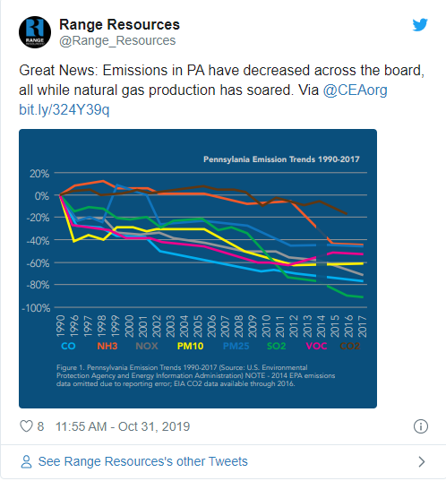
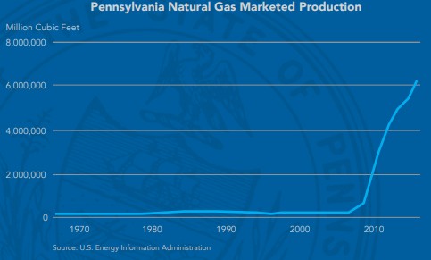
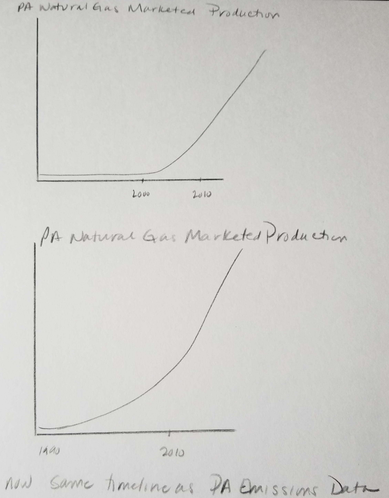
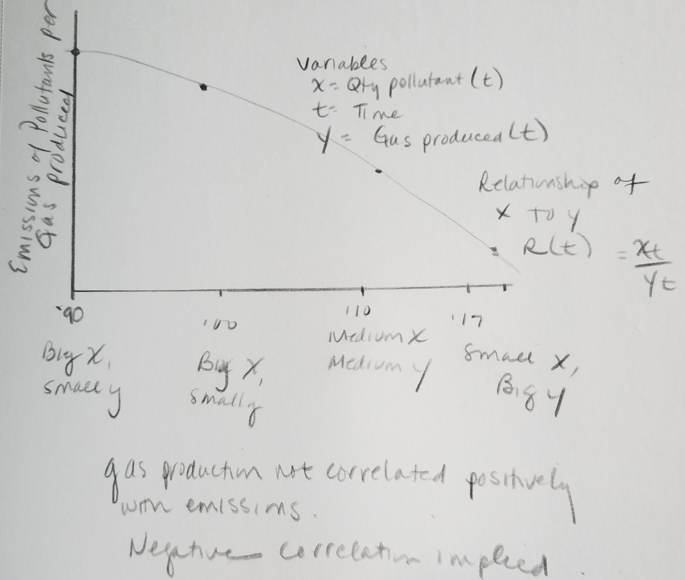

# Critique by Design

## The original visualizations

The original visualization I chose appeared in the [Desmog Blog](https://www.desmogblog.com/2019/10/31/consumer-energy-alliance-pennsylvania-air-quality-natural-gas) on October 31, 2019. This blog references a twitter post by Range Resources, which references [this post](https://consumerenergyalliance.org/2019/10/pennsylvanias-emissions-fell-92-energy-production-soared-3000/) by Consumer Energy Alliance (CEA), further referencing a [PDF report by CEA](https://consumerenergyalliance.org/cms/wp-content/uploads/2019/10/CEA_INFOGRAPHIC_PENNSYLVANIA.pdf). Shown here is the original tweet by Range Resources and another plot from the PDF.

### Why I selected this

I selected this visualization because there was quite a bit to work with! The data that the Consumer Energy Alliance is presenting came out after [The New York Times](https://www.nytimes.com/interactive/2019/10/24/climate/air-pollution-increase.html) published an article about the national rise in air pollution since 2016. The New York Times article references EPA data examined by researchers at Carnegie Mellon University.

The CEA is utlizing data from multiple sources (including the EPA) to argue a lack of relationship between natural gas production and harmful emissions. Choosing this visualization to redesign and critique provides an interesting insight into how data can be "used" to imply relationships beyond its scope.

## Re-Designed visualizations

### Process and wireframing

The redesign process began with critiquing the original visualization using Stephen Few's [Data Visualization Effectiveness Profile](http://www.perceptualedge.com/articles/visual_business_intelligence/data_visualization_effectiveness_profile.pdf) to determine what was effective and what could be improved. I ranked the orignial visualization at the low end of the scale for usefulness and perceptability. This was because the original graph did not show what the CEA was saying it did - a correlation between natural gas production and lowered emissions of various pollutants. 

I started with wireframing to improve some of the visual features of the graphs to enhance legibility and clarity. Then I planned an alternative approach to presenting the data to more effectively convey the intended message. Note that doing so does not improve the truthfulness of the narrative, but shows how improperly contextualized data can suggest certain take-aways.

The first main point to address was the time axis of the plot, as well as the use of proportions instead of percentage.

This timeline will allow for a shared axis of gas production with the emissions data.

To further stress the point that (though this is a horribly myopic perspective) that emissions and gas production are trending in opposite directions, the redesign will plot the emissions **per** gas production.

The opposite trends should compound to a starker trend.

### Feedback on wireframes

When I shared my wireframe sketches with individuals (outside of Telling Stories with Data classmates) responses included:

"As time goes on, the emissions have gone down a lot."
"Where is the data for gas production?"
"What is this supposed to show again?"
"Do you produce less emissions with more gas?"
"Is this trying to show that gas production has become more efficient over the years?"
"I would probably want to see the gas production on this graph."
"The intended audience isn't environmentally conscious."

This feedback helped inform the data visualization redesign process. Notably, it would help to reduce confusion to show a raw display of gas production.

### Data extraction and processing

The next task at hand was to extract the raw data referenced in the CEA PDF.

Though sources were cited in the PDF report, it was not immediately clear in all instances which source was precisely being used for their graph. The EPA data for the emissions was the easiest to locate: this had the timecourses for the emissions (except CO2) across different production sectors. The PDF did not make it clear how they processed this across sectors so their analysis was not fully documented in this regard. For my analysis, I totaled all sectors for each emission group per year. I then normalized each timecourse to the value for 1990.

For the CO2 data, it was not fully clear which data they had pulled from. I found an [EIA report](https://www.eia.gov/environment/emissions/state/) that provides state-wise data on CO2 that seemed a likely source (though it did include data for 2017, contrary to the CEA report's indication). This was also normalized to its 1990 value.

For the gas production data, it did not appear to be directly linked or cited from the PDF, but I did find it subsequently cited by one of the citations: https://www.eia.gov/state/analysis.php?sid=PA. This did not have a direct link to the source, but it provided enough information to Google: https://www.eia.gov/dnav/ng/ng_prod_sum_a_EPG0_VGM_mmcf_a.htm. This data was also normalized for display.

To provide the needed data for the Emissions per Gas Production graph, a calculation was made for each emission type (in a year) divided by the gas production (in that same year). Then all of these were normalized to their maximum value so that they could be displayed on the same axis. The gas production timecourse was also normalized to its maximum value for display alongside.

### Approach with Infogram

I used Infogram to produce the following data redesign.

<a href="https://infogram.com/3b705b9c-fce7-4d8c-8c1e-6b87ccf99ce0" style="color:#989898!important;text-decoration:none!important;" target="_blank">Blank template</a> <a href="https://infogram.com" style="color:#989898!important;text-decoration:none!important;" target="_blank" rel="nofollow">Infogram</a>

One limitation of Infogram is that I could not provide a second y-axis on the right side as I had desired.
