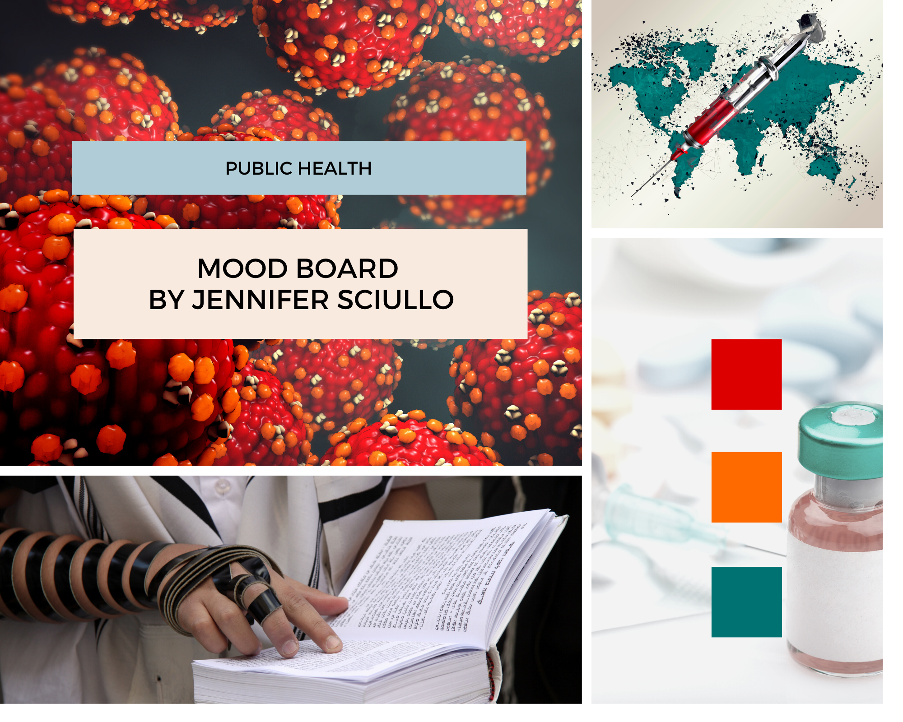

# Final Project Part II

## Research topic

Measles Resurgence and Vaccine Hesitancy in the US

## Background

Although the infectious disease of measles was declared eliminated from the US in the year 2000, the Centers for Disease Control and Prevention reported 1,261 confirmed cases of measles for 2019. As of October 2019 the number of reported cases slowed down and the US maintained its mealses elimination status. The uptick in the number of confirmed cases in the US this past year is cause for concern. My final project examines current data on reported cases of measles and immunization rates in the US to tell the story of measles resurgence and how vaccine hesitancy plays a role in public health.

## Target audience

 * Possible fencesitters on the public health topic of immunizations (for themselves/their dependents).
 * Community advocates who can help educate others about the benefits of herd immunity.

## Storyboard

Storyboard designed via Balsamiq.

## User research

I conducted [user research](interviews/TSWD_user_research_interviews.md) to gain insights into my proposed data visualizations for Part II of my final project.

## Changes implemented

### Visualization 1, slide 1

Based on the feedback on this slide, I did the following:

 * Specifically noted the country (the US) in which these cases are reported.
 * Added the count for cases in Pennsylvania in 2019.
 * Provided context for the timing of data in 2019.
 * Provided a small amount of context for these numbers in relation to the past. As well as some context for the reporting of data.

### Visualization 2, slide 2

 * Noted the age range of the children for the data.
 * Although the choice was consciously made to avoid color for the wireframe, since it was explicitly called out in feedback, I implemented some color to make the plot more clear.
 * Clarified that the data is shown with a 95% confidence interval.

### Visualization 3, Slide 3

The plots on slide 3 are largely an approach to re-present the data in the prior one, with an easier eye towards trends in relations. Most of the feedback is seeking greater context than
is feasible to add. For this one, I merely added context for the data's age range

### Visualization 4, Slide 3

As for Visualization 3. I also implemented the feedback that called for the recommended vaccination rate of 95% be called out.

### Visualization 4, Slide 4

The interactive plot of the data here contains more information than the flat image. I provided better context in labelling, and also prompting to explore the interactivity.

## Optional moodboard

Moodboard designed via Canva.

