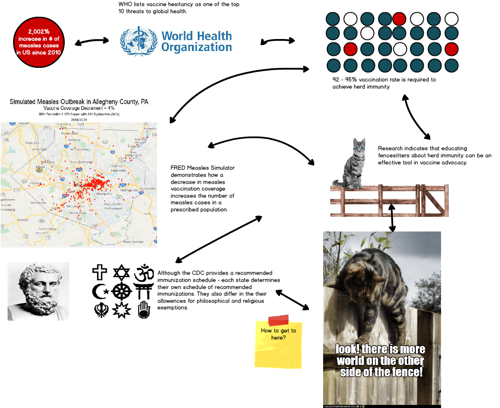

# TSWD Final Project Part II

## Research topic

Measles Resurgence and Vaccine Hesitancy in the US

## Background

Although the infectious disease of measles was declared eliminated from the US in the year 2000, the Centers for Disease Control and Prevention reported 1,261 confirmed cases of measles for 2019. As of October 2019 the number of reported cases slowed down and the US maintained its mealses elimination status. The uptick in the number of confirmed cases in the US this past year is cause for concern. My final project examines current data on reported cases of measles and immunization rates in the US to tell the story of measles resurgence and how vaccine hesitancy plays a role in public health.

## Target audience

 * Possible fencesitters on the public health topic of immunizations (for themselves/their dependents).
 * Community advocates who can help educate others about the benefits of herd immunity.

## Storyboard

Storyboard designed via Balsamiq.

## User research

I conducted [user research](interviews/TSWD_user_research_interviews.md) to gain insights into my proposed data visualizations for Part II of my final project.

## Changes implemented

## Optional moodboard

Moodboard designed via Canva.

